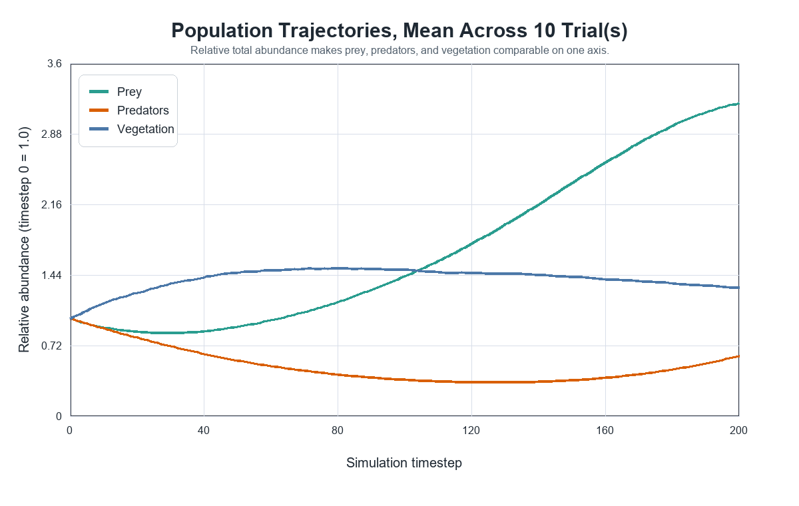
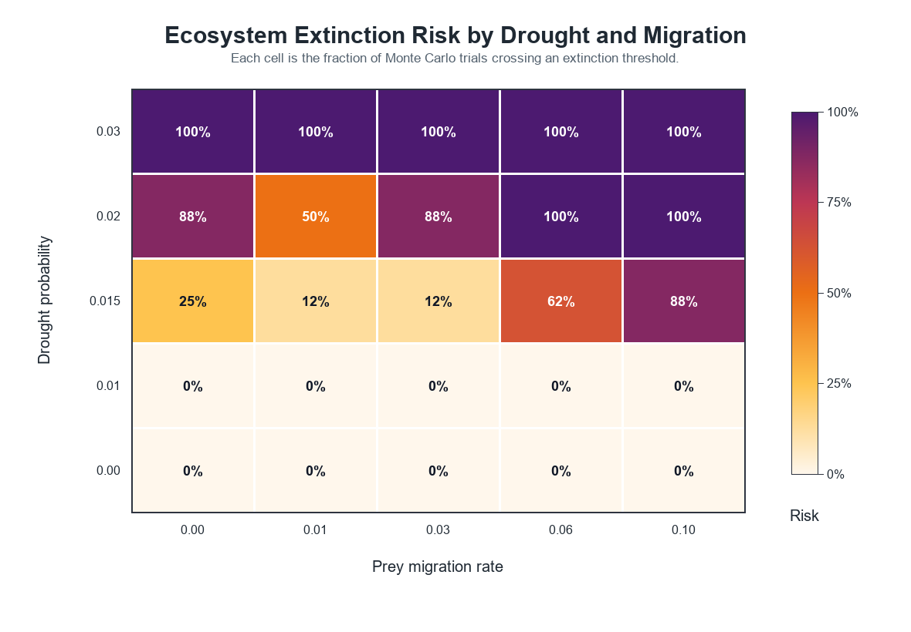
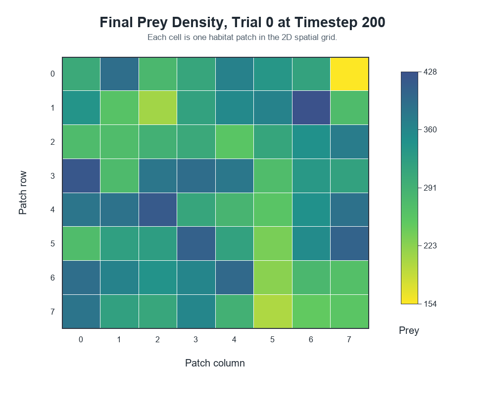

# Spatial Ecology RS

Computational ecology model for studying stochastic trophic dynamics across spatially connected habitat patches. The model represents coupled prey, predator, and vegetation state variables on a two-dimensional landscape, with dispersal, habitat fragmentation, drought, disease, and Monte Carlo parameter sweeps.

The repository is organized as a reproducible simulation study: model equations are documented, scenario parameters are encoded in TOML files, stochastic runs are seeded, and outputs are written as analysis-ready CSV files with Python visualization scripts.



## Scientific Questions

- How does connectivity among habitat patches affect trophic stability?
- Under what drought regimes do prey or predator populations cross functional extinction thresholds?
- Does dispersal buffer local environmental disturbance, or can it synchronize collapse across the landscape?
- How sensitive are extinction outcomes to fragmentation, predation pressure, and vegetation recovery?

## Model Overview

The model is a discrete-time stochastic patch-dynamics system. Each habitat patch tracks:

- prey abundance
- predator abundance
- vegetation biomass
- rainfall
- temperature
- disease pressure
- carrying capacity

At each timestep the engine applies local biological updates, conservative migration between neighboring patches, stochastic environmental disturbance, validation checks, and metrics recording. The landscape uses a von Neumann neighborhood on a 2D grid, with random edge removal controlled by a fragmentation parameter.

The full model specification is in [docs/model_description.md](docs/model_description.md).

## Reproducible Execution

```bash
cargo build --release
cargo test
cargo run --release -- --config configs/baseline.toml --trials 10 --seed 42
```

The reference scenario writes:

- `results/baseline.csv`: patch-level state by trial and timestep.
- `results/summary.csv`: one summary row per trial.

## Experimental Design

The included scenarios are intended to support small computational experiments rather than one-off demos.

```text
configs/baseline.toml              Reference landscape dynamics
configs/drought_scenario.toml      Elevated drought and disturbance regime
configs/migration_sweep.toml       Drought-connectivity phase space
configs/fragmentation_sweep.toml   Fragmentation and predation sensitivity
```

Run the drought-connectivity sweep:

```bash
cargo run --release -- --config configs/migration_sweep.toml
python analysis/plot_extinction_heatmap.py results/sweep_summary.csv figures/extinction_risk_heatmap.png
```

The sweep varies migration and drought probability while holding fragmentation fixed:

```toml
[sweep]
migration_rates = [0.0, 0.01, 0.03, 0.06, 0.10]
drought_probabilities = [0.0, 0.010, 0.015, 0.020, 0.030]
fragmentation_rates = [0.35]
```



## Outputs

Patch-level output:

```text
trial,timestep,patch_id,row,col,prey,predators,vegetation,rainfall,temperature,event,scenario,seed,disease_pressure
```

Trial-level summary output:

```text
trial,seed,steps,rows,cols,final_prey,final_predators,final_vegetation,
prey_extinct,predator_extinct,time_to_prey_extinction,time_to_predator_extinction,
mean_prey,mean_predators,mean_vegetation,migration_rate,drought_probability,
disease_probability,fragmentation_rate,predation_rate,stability_score,
recovery_time_after_drought,scenario
```

The summary table is designed for estimating extinction probabilities, mean time-to-threshold, and comparative sensitivity across parameter settings.

## Visualization

```bash
python analysis/plot_population_timeseries.py results/baseline.csv figures/population_timeseries.png
cargo run --release -- --config configs/migration_sweep.toml
python analysis/plot_extinction_heatmap.py results/sweep_summary.csv figures/extinction_risk_heatmap.png
python analysis/plot_spatial_snapshots.py results/baseline.csv figures/spatial_population_map.png
```

The plotting scripts use Matplotlib when available and fall back to a labeled Pillow renderer when Matplotlib is not installed.



## Repository Structure

```text
src/
  main.rs          CLI entry point
  config.rs        scenario and sweep configuration parser
  simulation.rs    timestep engine and spatial migration
  patch.rs         habitat patch state representation
  species.rs       trophic update equations
  climate.rs       stochastic environmental disturbance
  metrics.rs       extinction and stability metrics
  output.rs        CSV writers
  validation.rs    numerical and biological sanity checks
configs/           reproducible scenarios and sweeps
analysis/          Python plotting scripts
docs/              model specification
results/           generated CSV artifacts
figures/           generated figures
```

## Reproducibility Notes

All stochastic processes are seeded. For a fixed configuration, trial count, and base seed, the model produces deterministic CSV output. Trial seeds are derived from the base seed, scenario index, and trial index.

The model is intentionally synthetic: parameters are selected to demonstrate computational experimentation with spatial ecological dynamics, not to calibrate a specific empirical ecosystem.

## Extensions

- Estimate confidence intervals for extinction probabilities.
- Add weighted empirical connectivity networks.
- Compare patch-dynamics outcomes with reaction-diffusion approximations.
- Parallelize Monte Carlo execution.
- Calibrate parameters against field or remote-sensing datasets.
